# Capítulo: Identificação de Conceitos e Atributos
## Exercícios de Fixação

> Exercício 1 (RESOLVIDO): Deseja-se construir um sistema para manter um registro de artistas
musicais e seus álbuns. Cada álbum possui várias músicas, as quais poderão ser consultadas pelo
sistema. O sistema também deve permitir a busca de artistas por nome ou nacionalidade. O sistema
também deve ser capaz de exibir um relatório dos álbuns de um artista, o qual pode ser ordenado por
nome, ano, ou duração total do álbum. Um álbum pode ter a participação de vários artistas, sem
distinção. Já a música pode possuir um ou mais autores e intérpretes (todos considerados artistas).

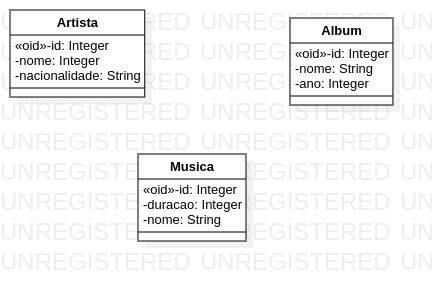

> Exercício 2: Deseja-se construir um sistema para gerenciar as informações de campeonatos de
handebol, que ocorrem todo ano. Deseja-se saber nome, data de nascimento, gênero e altura dos
jogadores de cada time, bem qual deles é o capitão de cada time. Cada partida do campeonato ocorre
em um estádio, que possui nome e endereço. Cada time possui seu estádio-sede e, assim, cada partida
possui um time mandante (anfitrião) e o time visitante. O sistema deve ser capaz de listar as partidas
já ocorridas e não ocorridas de um campeonato. O sistema deve também ser capaz de listar a tabela do
campeonato, ordenando os times por classificação, que é calculada em primeiro lugar por saldo de
vitórias e em segundo lugar por saldo de gols.

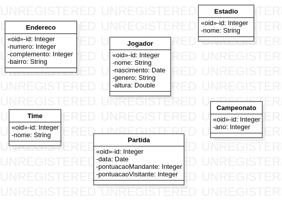

> Exercício 3: Deseja-se fazer um sistema de rede social. Nesta rede social, os usuários podem seguir e
ser seguidos por outros usuários. O perfil do usuário deve permitir cadastrar nome, email, data de
nascimento, website, gênero, telefone e foto do perfil. Os usuários podem fazer postagens de texto em
sua própria "linha do tempo" (timeline) da rede social, sendo que podem anexar também fotos às
postagens. Uma foto é referenciada pela URI de seu local de armazenamento. As fotos podem ser
organizadas em álbuns, sendo que cada álbum possui um título.

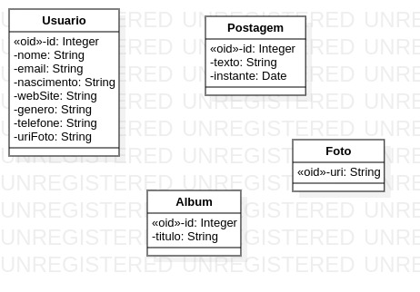

## Diagram class and object
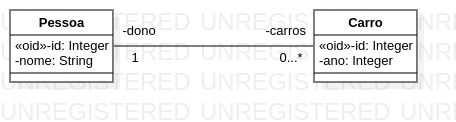
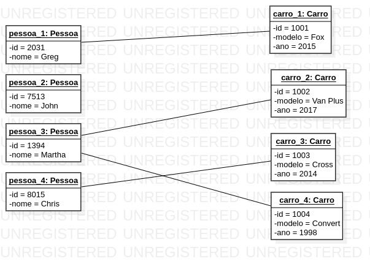

# Capítulo: Associações e multiplicidade de papéis
## Exercícios de Fixação

Para cada exercício, fazer:
- Desenhar o Modelo Conceitual
- Esboçar uma instância atendendo os requisitos mínimos pedidos

> Exercício 1 (RESOLVIDO): Deseja-se construir um sistema para manter um registro de artistas
musicais e seus álbuns. Cada álbum possui várias músicas, as quais poderão ser consultadas pelo
sistema. O sistema também deve permitir a busca de artistas por nome ou nacionalidade. O sistema
também deve ser capaz de exibir um relatório dos álbuns de um artista, o qual pode ser ordenado por
nome, ano, ou duração total do álbum. Um álbum pode ter a participação de vários artistas, sem
distinção. Já a música pode possuir um ou marelational_2.jpgis autores e intérpretes (todos considerados artistas).
Instância mínima: 2 artistas, 3 álbuns, 4 músicas

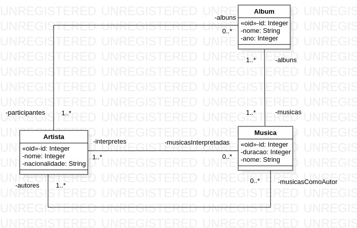
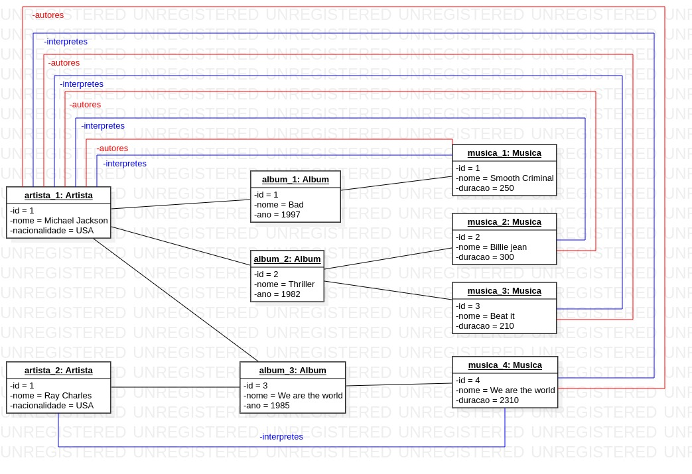

> Exercício 2 (RESOLVIDO): Deseja-se construir um sistema para gerenciar as informações de
campeonatos de handebol, que ocorrem todo ano. Deseja-se saber nome, data de nascimento, gênero e
altura dos jogadores de cada time, bem como qual deles é o capitão de cada time. Cada partida do
campeonato ocorre em um estádio, que possui nome e endereço. Cada time possui seu estádio-sede e,
assim, cada partida possui um time mandante (anfitrião) e o time visitante. O sistema deve ser capaz
de listar as partidas já ocorridas e não ocorridas de um campeonato. O sistema deve também ser capaz
de listar a tabela do campeonato, ordenando os times por classificação, que é calculada em primeiro
lugar por saldo de vitórias e em segundo lugar por saldo de gols.
Instância mínima: 1 campeonato, 2 partidas, 2 times, 2 jogadores em cada time

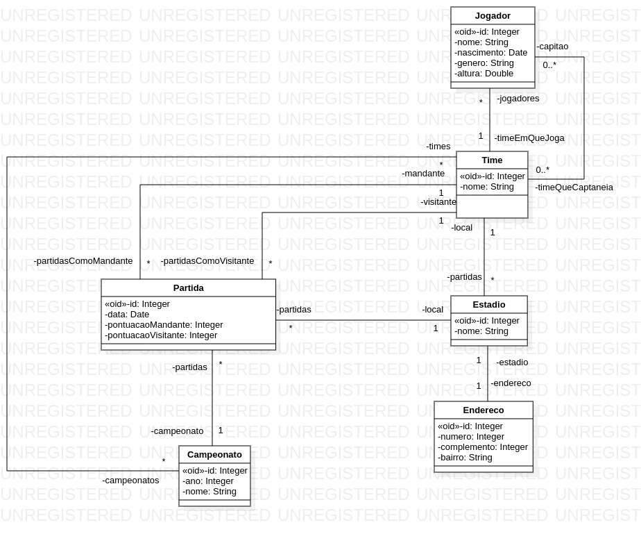
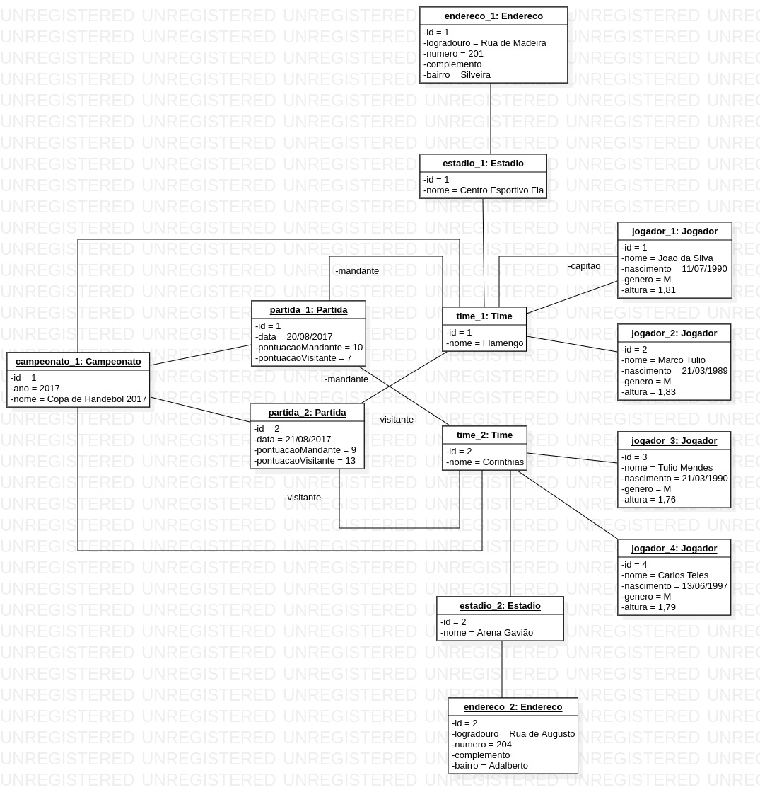

> Exercício 3: Deseja-se fazer um sistema de rede social. Nesta rede social, os usuários podem seguir e
ser seguidos por outros usuários. O perfil do usuário deve permitir cadastrar nome, email, data de
nascimento, website, gênero, telefone e foto do perfil. Os usuários podem fazer postagens de texto em
sua própria "linha do tempo" (timeline) da rede social, sendo que podem anexar também fotos às
postagens. Uma foto é referenciada pela URI de seu local de armazenamento. As fotos podem ser
organizadas em álbuns, sendo que cada álbum possui um título.
Instância mínima: 4 usuários, pelo menos um usuário com mais de uma postagem, pelo menos um
álbum com mais de uma foto.

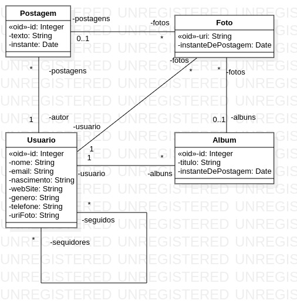
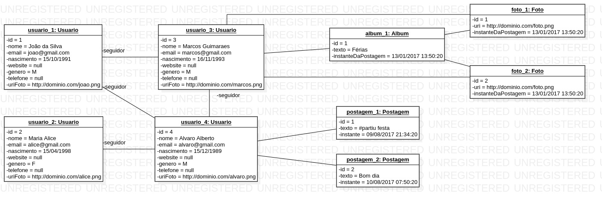

> Exercício 4: Deseja-se construir um sistema para gerenciar as informações dos participantes das
atividades de um evento acadêmico. As atividades deste evento podem ser, por exemplo, palestras,
cursos, oficinas práticas, etc. Cada atividade que ocorre possui nome, descrição, preço, e pode ser
dividida em vários blocos de horários (por exemplo: um curso de HTML pode ocorrer em dois blocos,
sendo necessário armazenar o dia e os horários de início de fim do bloco daquele dia). Para cada
participante, deseja-se cadastrar seu nome e email.
Instância mínima: 2 atividades, 4 participantes, pelo menos uma atividade com mais de um bloco de
horários.Exercício

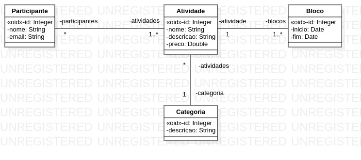
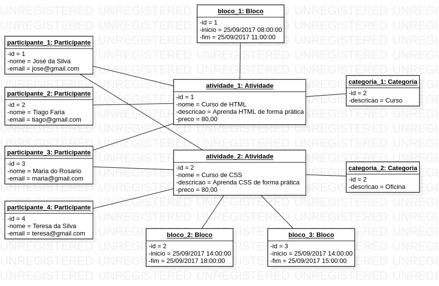

> 5: Deseja-se fazer um sistema para manter dados de cidades (nome, estado, website), onde
cada cidade possui um ou mais restaurantes (nome, valor da refeição) e hotéis (nome, valor da diária).
Além disso, deseja-se registrar pacotes turísticos vendidos. Para registrar um pacote turístico, deve-se
escolher uma cidade, definir a data da viagem, o hotel de hospedagem e o número de dias de
permanência. Deve-se também definir se no pacote vai estar incluso ou não um restaurante e, se sim,
quantas refeições por dia serão consumidas.
Instância mínima: 1 cidade, 2 hotéis e 2 restaurantes, 2 pacotes turísticos.

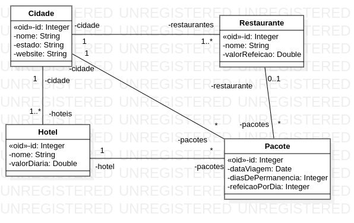
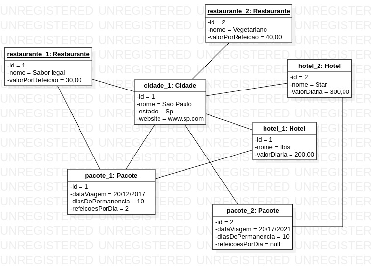

# Capítulo: Associações todo-parte e classe de associação
## Exercícios de Fixação

Para cada exercício, fazer:
- Desenhar o Modelo Conceitual
- Esboçar uma instância atendendo os requisitos mínimos pedidos

> Exercício 1 (RESOLVIDO): Deseja-se fazer um sistema para armazenar as informações de uma
locadora de jogos digitais. Cada jogo pode rodar em mais de uma plataforma (Xbox, PS3, PS4,
PC, etc.). Cada jogo possui seu preço diário de locação, sendo que um mesmo jogo pode ter
preços de locação diferentes para cada plataforma. Quando um cliente (nome, email, telefone,
senha) deseja fazer uma locação, ele informa quais jogos ele quer locar, informando inclusive de
qual plataforma é cada jogo contido na locação a ser realizada. Quando a locação é realizada, a
data atual deve ser registrada para esta locação. Para cada jogo locado, o cliente informa quantos
dias ele deseja ficar com cada um (note que ele pode alugar, por exemplo, um jogo X da
plataforma Xbox por 2 dias e um jogo Y da plataforma PC por 5 dias, tudo para a mesma
locação). A locadora também possui alguns consoles de vídeo game, os quais podem ser usados
no local pelos clientes por um certo intervalo de tempo. Cada console possui um preço por cada
hora (ou fração) utilizada, e contém um conjunto de acessórios (headphone, controle, Kinect,
etc.).
Instância mínima: 2 plataformas, 2 jogos para cada plataforma, 2 clientes, 2 locações, 2 itens para cada locação, 2
consoles, pelo menos um console com mais de um acessório, pelo menos um cliente com mais de uma utilização de
console.

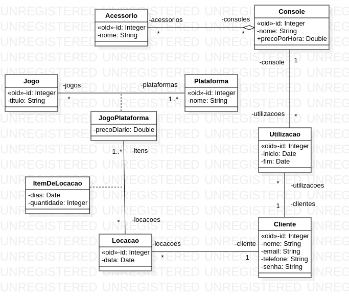
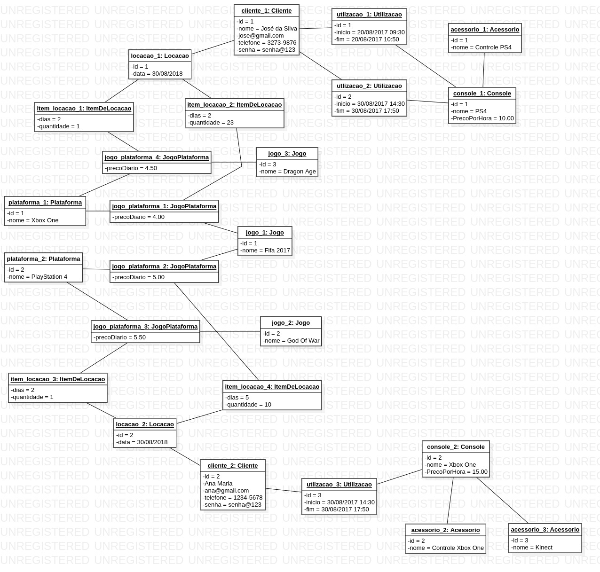

> Exercício 2: Deseja-se construir um sistema acadêmico. Para isso, são registrados os cursos
disponíveis, onde cada um possui um nome, carga horária e valor. Quando um curso vai ser
oferecido, é registrada uma turma, informando os seguintes dados: número da turma, data de
início e número de vagas. Uma matrícula de um aluno em uma turma consiste na data de
matrícula e no número de prestações em que o aluno vai pagar o curso. Para cada aluno, é
necessário cadastrar seu nome, cpf, e data de nascimento. Cada aluno passa por várias avaliações
durante o desenrolar do curso que está cursando. Uma avaliação possui nota e data. Depois que a
avaliação ocorre, é registrado resultado de cada aluno da turma (a nota que ele tirou). Um aluno é
aprovado em um curso se sua nota total for maior ou igual à nota mínima de aprovação prevista
para o curso.
Instância mínima: 1 curso, 1 turma, 2 matrículas e 2 avaliações com resultados.

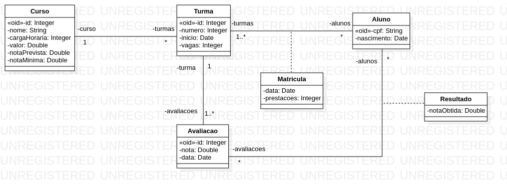
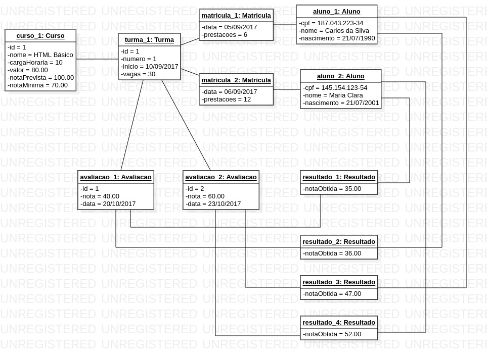

> Exercício 3: Uma biblioteca deseja fazer o registro de seus empréstimos de livros. Quando um
usuário pega um livro emprestado, deve ser registrada a data de empréstimo. Por padrão, o prazo
de empréstimo é de dois dias, considerando atraso se o livro for devolvido depois deste tempo.
Cada livro possui um título, gênero, editora e número de páginas. Um livro pode participar de
uma coleção. Cada livro também possui um valor diário de multa, caso o usuário devolva o livro
com atraso em relação à data prevista de devolução.
Instância mínima: 3 livros, 1 usuário, 2 empréstimos. Pelo menos um livro participando de uma coleção

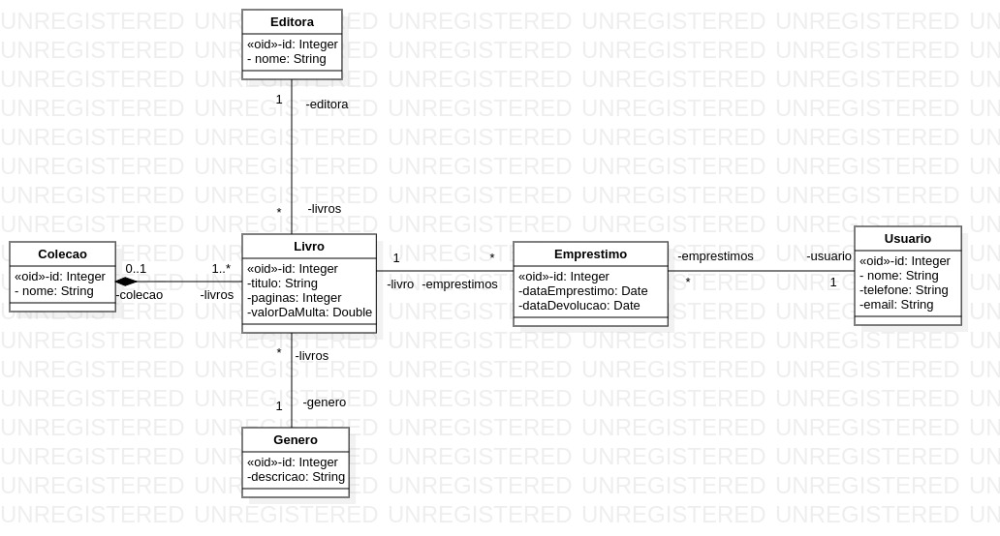
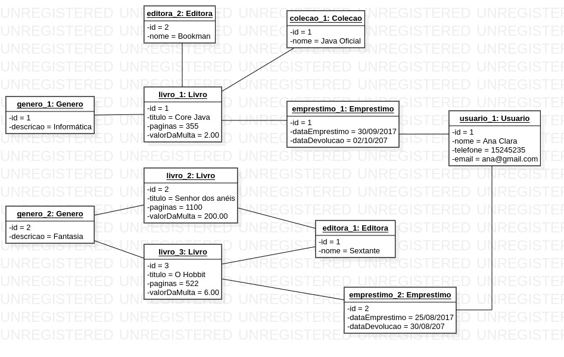

# Capítulo: Herança, Enumerações e Tipos Primitivos
## Exercícios de Fixação

Para cada exercício, fazer:
- Desenhar o Modelo Conceitual
- Esboçar uma instância atendendo os requisitos mínimos pedidos

> Exercício 1 (RESOLVIDO): Uma locadora de carros deseja fazer um sistema para armazenar
as informações das locações que os clientes fazem. A locadora possui diversas sedes, sendo que
cada sede possui um código e uma localidade, sendo que uma localidade é armazenada
internamente por dois números de ponto flutuante (exemplo: a localidade 18°56'04.4"S
48°17'29.7"W é armazenada como -18.9345654, -48.2915811). Para cada locação é necessário
registrar a data e horário em que o cliente pega o carro, bem como a sede da qual o carro foi
retirado. Há dois tipos de locação: a diária e a de longo período. Quando a locação for diária,
deve-se armazenar o número de dias previstos para devolução do carro. Quando a locação for de
longo período, deve-se armazenar a porcentagem de desconto dada no valor da diária. Em todos
os casos, a data e horário em que o carro foi devolvido devem ser armazenados. Os dados de
cada carro são modelo, placa, cor, ano e data de aquisição. A locadora trabalha somente com
carros de cor branca, preta, cinza e vermelha. Os dados dos clientes são nome, cpf, email e seus
telefones. Cada carro pertence a uma categoria, sendo que cada categoria de carro possui um
valor de diária de locação.
Instância mínima: 1 cliente, 2 carros, 3 locações.

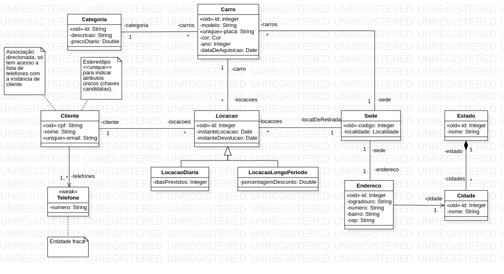
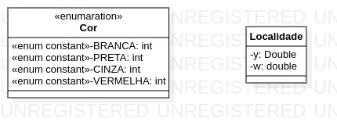
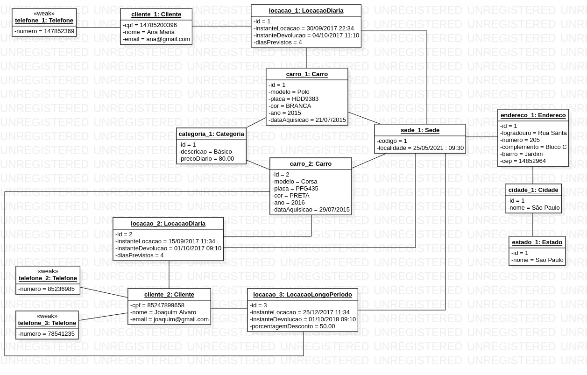

> Exercício 2: Deseja-se fazer um sistema de pedidos. Um ou mais produtos podem ser vendidos
em cada pedido, sendo que a cada produto pode ser dado um desconto diferente, e também cada
produto pode ser vendido em uma ou mais unidades. Cada produto possui nome e preço, e pode
pertencer a várias categorias. Cada pedido é feito por um cliente, que deve ter em seu cadastro
nome, telefones, email, cpf ou cnpj, e um ou mais endereços, sendo que o cliente deve
especificar um endereço para entrega na hora de comprar. Para um pedido, deve ser registrado o
instante em que é realizado e o endereço de entrega. Um pedido deve ser pago ou por boleto, ou
por cartão de crédito. No caso de boleto, deve-se armazenar a data de vencimento e a data de
pagamento. No caso de cartão de crédito, deve-se armazenar o número de parcelas. Todo
pagamento possui um estado (pendente, quitado ou cancelado).
Instância mínima: 1 cliente, 3 produtos, 2 pedidos, pelo menos um pedido com mais de um
produto, pelo menos um pedido pago com cartão de crédito e um com boleto.

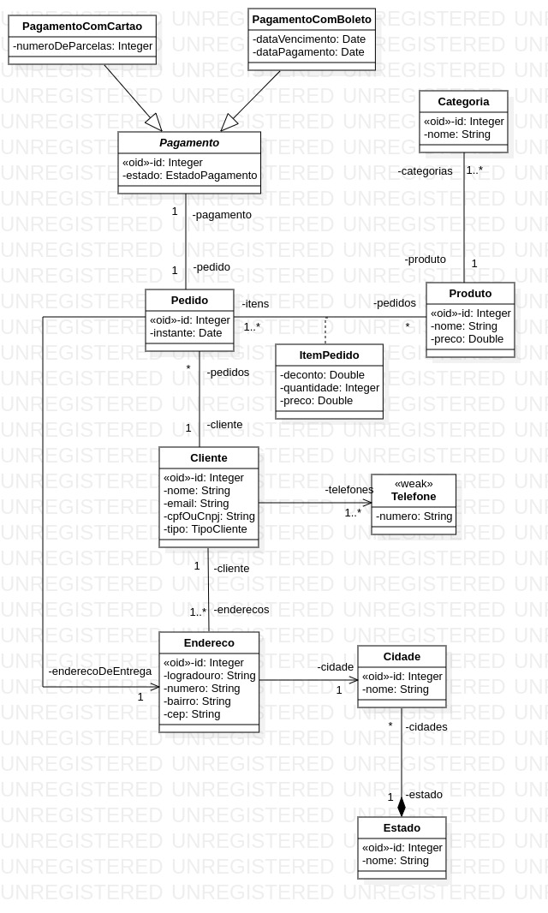
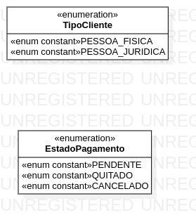
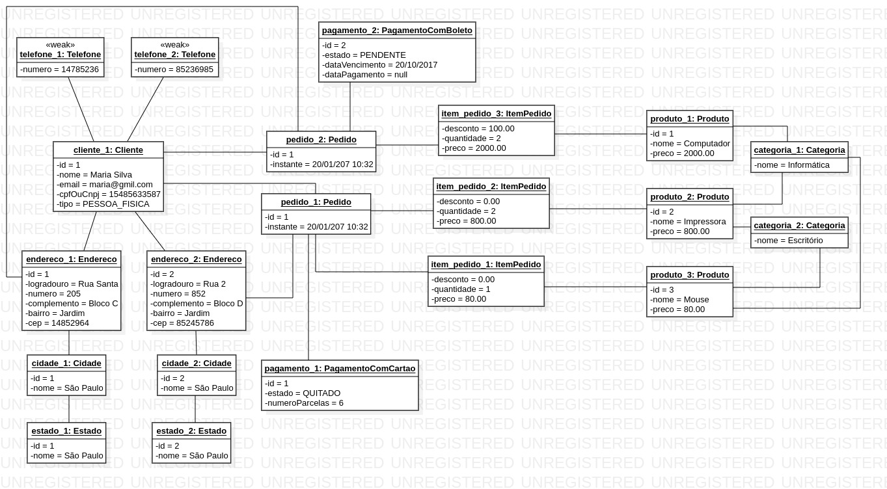

> Exercício 3: Deseja-se fazer um sistema para gerenciar informações de uma companhia aérea.
Para isto, deve-se manter um cadastro das pessoas no sistema, sendo que é possível ter
passageiros e pilotos. Toda pessoa possui cpf, nome e sexo, enquanto que pilotos possuem um
número de licença de voo, e os passageiros possuem data de nascimento e um ou mais telefones.
Quando um passageiro faz uma reserva de voo, deve ser registrado o assento deste passageiro no
voo. O sistema também deve manter a informação de quem foi o piloto de cada voo, além do
número, data e horário do voo.
Instância mínima: 2 pilotos, 3 passageiros, 2 voos. Pelo menos um passageiro com mais de um
telefone. Pelo menos um voo com mais de um passageiro. Um dos pilotos deve ser passageiro de
um voo (obviamente não pilotado por ele).
